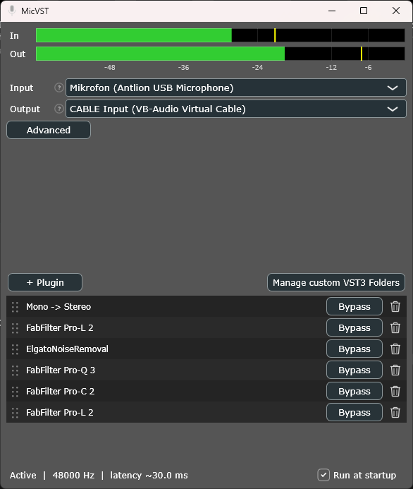

# MicVST

**Run your microphone through a chain of VST3 plugins and use the result as a virtual microphone in any app.**

MicVST is a lightweight Windows tray app. It takes one microphone, runs it through the VST3
effects you choose (EQ, de-noise, compression, …) and sends the processed signal to a **virtual
audio cable** — which any application (Discord, OBS, Zoom, Voicemod, games, …) can then use as a
microphone input.

Think of it as a minimal alternative to VoiceMeeter / Wave Link when all you want is:
*one input, plugins on it, out as a virtual mic.*

```
Mic  →  MicVST (your VST3 chain)  →  VB-Cable (CABLE Input → CABLE Output)  →  Discord / OBS / Zoom / …
```



---

## Download

Grab the latest portable build — **no installer, no dependencies**, just run the `.exe`:

➡️ **[Download MicVST.exe](https://github.com/philipz794/MicVST/releases/latest/download/MicVST.exe)**

(Statically linked, x64. No Visual C++ Redistributable required.)

The `.exe` is **not code-signed**, so Windows SmartScreen may warn *“Windows protected your
PC”* — click **More info → Run anyway**. Each release lists the file’s **SHA-256** so you can
verify your download (`Get-FileHash MicVST.exe -Algorithm SHA256` in PowerShell).

You also need a **virtual audio cable**. The free **[VB-Cable](https://vb-audio.com/Cable/)** is
recommended — MicVST detects it automatically. VoiceMeeter and Virtual Audio Cable work too.

## Setup

1. **Install [VB-Cable](https://vb-audio.com/Cable/)** and reboot. (If no cable is installed,
   MicVST shows an orange hint with the download link.)
2. **Run `MicVST.exe`.** On first start it picks your default microphone as input and the detected
   virtual cable (e.g. *CABLE Input*) as output. Both are changeable in the audio setup and are
   remembered across restarts.
3. **Build your plugin chain** (bottom list, “+ Plugin”):
   - add any VST3 effects you like (e.g. a noise-suppressor, EQ, compressor),
   - optionally insert the built-in **Mono → Stereo** node at the point where you want stereo
     (before it the chain runs mono = less CPU),
   - drag rows by the **handle on the left** to reorder; the **trash icon on the right** removes a
     plugin (with confirmation). Double-click a row to open the plugin’s editor.
4. **In your target app** (Discord/OBS/Zoom/…), select **CABLE Output** as the microphone.
5. Done. Device and plugin settings (including each plugin’s state) are saved automatically.

### Run in background (tray, autostart)

Right-click the tray icon → **“Run at Windows startup”** to launch MicVST silently into the tray on
boot (no window, engine running). For a stable setup, copy the `.exe` to a fixed location first
(e.g. `C:\Tools\MicVST\`) and enable autostart from there.

## Features

- One mic → ordered **VST3 plugin chain** → virtual cable output
- **Automatic cable detection** (VB-Cable / VoiceMeeter / Virtual Audio Cable) with a download hint
  when none is found
- **Channel-aware routing** — the chain can start mono and switch to stereo at a placeable
  **Mono → Stereo** node (so a mono noise-suppressor doesn’t cost double)
- Horizontal **in/out level meters** with a dB scale
- **Drag-to-reorder** plugin list, per-row bypass, remove with confirmation, per-plugin editor
  windows
- Scans the standard VST3 folder; **add custom VST3 folders** via “+ Plugin → Add VST3 folder…”
  (a plugin that crashes the scan is remembered and skipped next time)
- Persistent settings (`%APPDATA%\MicVST\config.xml`), low latency, silent **tray autostart**
- Single portable `.exe`, no install, no runtime dependencies

## Build from source

Requires **Windows 11 x64** and **Visual Studio 2022** with the *Desktop development with C++*
workload (MSVC + Windows SDK + CMake). JUCE is fetched automatically via CMake `FetchContent`
(JUCE 8.0.13) — nothing else to install.

```powershell
$cmake = "C:\Program Files\Microsoft Visual Studio\2022\Community\Common7\IDE\CommonExtensions\Microsoft\CMake\CMake\bin\cmake.exe"

# Configure (fetches JUCE)
& $cmake -S . -B build -G "Visual Studio 17 2022" -A x64

# Release build -> build\MicVST_artefacts\Release\MicVST.exe (self-contained, ~8 MB)
& $cmake --build build --config Release --target MicVST

# Optional: unit tests (exit code 0 = ok)
& $cmake --build build --config Release --target MicVSTTests
.\build\MicVSTTests_artefacts\Release\MicVSTTests.exe
```

The build uses the static MSVC runtime (`/MT`), so the resulting `.exe` runs on any Windows 11 x64
machine without the Visual C++ Redistributable.

## How it works

- An **AudioProcessorGraph** wires the input device → your plugin chain → the output device,
  driven by JUCE’s `AudioDeviceManager` (WASAPI shared mode).
- Per hop, `min(source.outs, target.ins)` channels are connected, so variable channel width
  (the mono→stereo transition) is routed correctly and automatically.
- The output device is just a normal render endpoint — pointing it at a virtual cable’s *input*
  endpoint lets the cable’s driver loop the audio to its *output* (capture) endpoint, which other
  apps read as a microphone. No special “output plugin” needed.

## Notes

- **rnnoise** (noise suppression) is available as a VST3 here:
  <https://github.com/werman/noise-suppression-for-voice/releases> — drop the `.vst3` into
  `C:\Program Files\Common Files\VST3\` and restart. It runs at **48 kHz**; for low CPU use the
  mono variant and place it before the built-in Mono → Stereo node.
- Third-party software (JUCE, your VST3 plugins, VB-Cable, …) is subject to its own licenses. This
  repository contains only the MicVST source.

## License

MicVST is free software licensed under the **GNU General Public License v3.0** — see
[LICENSE](LICENSE). It uses **[JUCE](https://juce.com)**, whose free open-source tier is GPL, so
MicVST is GPL too. Third-party software (JUCE, your VST3 plugins, VB-Cable, …) is subject to its own
licenses; this repository contains only the MicVST source.

```
Copyright (C) 2026 Philip Zimmermann
This program is free software: you can redistribute it and/or modify it under the terms of the
GNU General Public License as published by the Free Software Foundation, either version 3 of the
License, or (at your option) any later version. It is distributed WITHOUT ANY WARRANTY; without
even the implied warranty of MERCHANTABILITY or FITNESS FOR A PARTICULAR PURPOSE.
```
